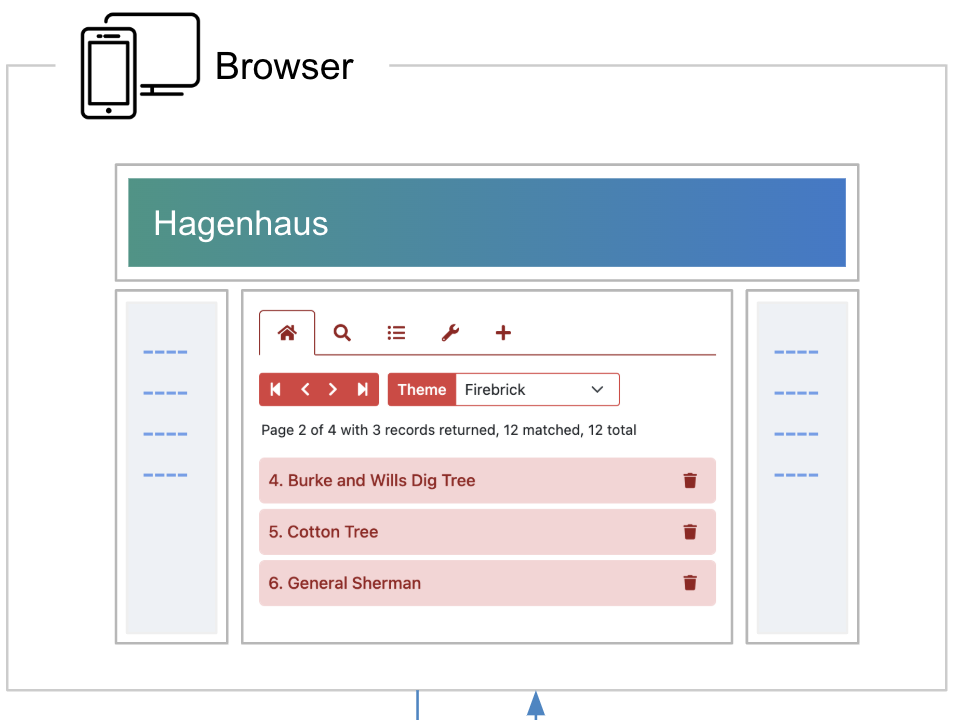
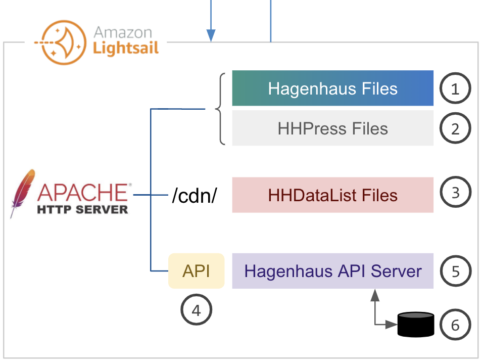

# Website

The diagram below illustrates the primary building blocks of my website:

<div class="mb-3">
  <div class="d-none d-md-block">
    <div></div>
  </div>
  <div class="d-md-none">
    <div></div>
    <div></div>
  </div>
</div>

In the diagram above, the website in the Browser box is the sum of many parts. Some are not shown in the diagram including [Bootstrap](https://getbootstrap.com/), [Fontawesome](https://fontawesome.com/), and [Axios](https://axios-http.com/). Others are numbered in the Amazon Lightsail box and described below.

1. **Hagenhaus Files** include mostly html files and image files. The HHPress Generator converts markdown files like [this](https://github.com/hagenhaus/hagenhaus-com/blob/master/en/website/index.md) to these html files.

1. **HHPress Files** include template html files, a CSS file, and a JS file. I created HHPress, a responsive Jamstack that also includes the HHPress Generator mentioned above. While it does not leverage [Angular](https://angular.dev/), [React](https://react.dev/), or [Vue](https://vuejs.org/), it does utilize a simple, unique technique for loading only page sections that are not already loaded. [Learn more](hhpress/).

1. **HHDataList Files** include a CSS file and a handful of JS files. I created HHDataList, a UI component that access data from any REST API and display it on a page using an html `<div>` tag and a configurable JS object like this:

    ``` nonum js
    <div id="my-datalist" class="hh-data-list"></div>
    
    new HHDataList({
      id: 'my-datalist',
      // more options
    });
    ```

    Vist the [HHDataList](/en/hhdatalist/v0.0.2/) section to learn more.

1. **Hagenhaus API** is my REST API described by [this OpenAPI file](/en/website/hagenhaus-api/swagger-ui/hagenhaus-hagenhaus-api-2.0.0-resolved.yaml) which I host on my [Swagger UI](/en/website/hagenhaus-api/swagger-ui/) page, and on the [SwaggerHub](https://app.swaggerhub.com/apis/hagenhaus/hagenhaus-api/2.0.0) and [Postman](https://documenter.getpostman.com/view/8773841/2sAYBVhC1m) platforms. [Learn more](/en/website/hagenhaus-api/).

1. **Hagenhaus API Server** is an [Express.js](https://expressjs.com/) server to which [Apache](https://httpd.apache.org/) passes all `/api` requests. I created this server which enforces `BEARER` authentication for several operations. [Learn more](hagenhaus-api-server/).

1. The **Database** icon represents a [MariaDB Foundation](https://mariadb.org/) database that includes _lamansbaseballdb_ which is a hosted copy of the [Lahman Baseball Dataset](http://seanlahman.com/) and _hagenhausdb_ consisting of the countries, trees, and users tables along with some interesting stored procedures. HHDataList uses the Hagenhaus API to access these data. [Learn more](database/).